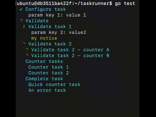

# Go Task Runner

[](https://godoc.org/github.com/era-dk/go-task-runner)

Simple Go task runner



## Install

```bash
go get github.com/era-dk/go-task-runner
```

## Example

Check example in [example_test.go](example_test.go)

```go
import taskRunner "github.com/era-dk/go-task-runner"

func main() {
    mainTask := &taskRunner.Task{
        Title: "",
        Hidden: true,
        SubtasksConcurrent: true,
        Subtasks: []*taskRunner.Task{
            {
                Title: "Task 1",
                OutputLines: 1,
                Resolver: func(ctx context.Context, task *taskRunner.Task, params *taskRunner.ParamsInterface) error {
                    myParams := (*params).(MyParamsStruct)
                    task.Msg(fmt.Sprintf("param key 1: %s", myParams.Key1))

                    myParams.Key2 = "value2"
                    *params = myParams

                    return nil
                },
            },
            {
                Title: "Concurrent Subtask 2",
                Subtasks: []*taskRunner.Task{
                    {
                        Title: "Quick task",
                        OutputLines: 2,
                        Resolver: counterFnResolver(2),
                    },
                    {
                        Title: "An error task",
                        Resolver: func(ctx context.Context, task *taskRunner.Task, params taskRunner.ParamsInterface) error {
                            return errors.New("it's an error exception")
                        },
                    },
                },
            },
        },
    }

    if err := taskRunner.NewRunner(mainTask).Run(context.Background(), MyParamsStruct{
        MyOption: "My Value"
    }); err != nil {
        log.Fatal(err)
    }
}
```
